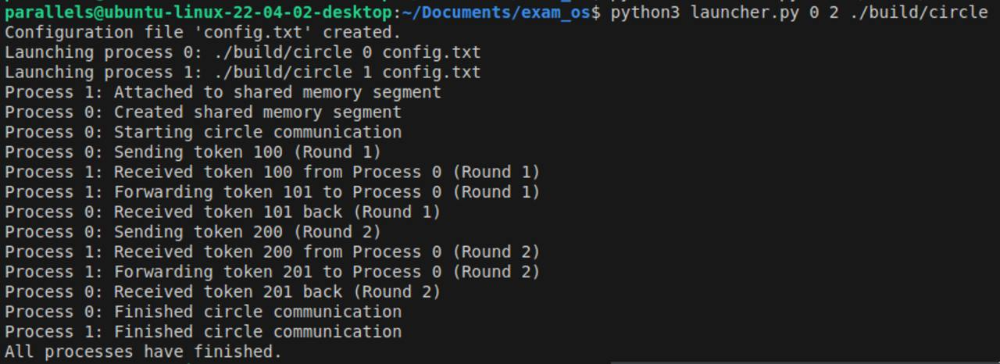

# Exam
Authors (team): Andrii Ahitoliev
Variant: Framework
## Prerequisites

Linux, G++ compiler

### Compilation

Standard with cmake:

```bash
mkdir build && cd build
cmake ..
make
```

### Usage

build directory will contain executables of the 'producer-consumer' program and 'cicle' program.

root directory has launch script - ```launch.py```. To execute, run:

```bash
python3 launcher.py 0 2 ./build/circle 
```

This will run the circle communication program with shared memory option and 2 processes. Example output:



There is **no** support for integration, however.

### Results

Here i will provide short description of the API (the mympi.cpp and mympi.h files):

**Classes**

**MyMPI**

The core class that handles communication setup, message passing, and synchronization.

Constructor: MyMPI(int argc, char** argv)
Destructor: ~MyMPI()

Description: Cleans up resources, detaching shared memory or closing socket connections.

**int get_world_size() const**

Returns: The number of processes in the MPI world (size of the communicator).

**int get_rank() const**

Returns: The rank of the current process in the communicator.

***void send(int dest, const void* data, size_t size)***

Description: Sends data to a specified destination process using either shared memory or socket-based communication.

**void receive(int source, void* buffer, size_t size)**

Description: Receives data from a specified source process using either shared memory or socket-based communication.

**void barrier()**

Description: Implements a barrier synchronization, where all processes wait until every process has reached the barrier. It uses shared memory or socket-based communication depending on the configuration.
